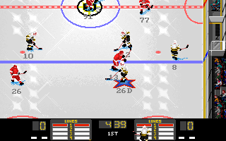
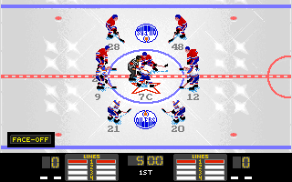
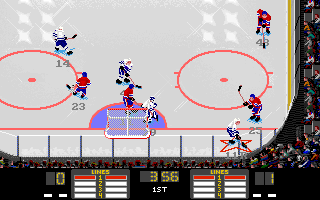

# NHL Hockey – Godot 4 port

A Godot 4.3 project rebuilding EA Sports NHL Hockey (DOS, 1994) from the disassembly in
[`re/nhl_hockey`](../../re/nhl_hockey). The simulation is a routine by routine translation of the decompiled
game; the graphics, team colours, rosters, HUD, speech, sound effects and music are read from the original game files, which
live in `re/nhl_hockey` of this repository (the project finds that directory on its own when it runs from a
checkout; another installation can be given with the `NHL_GAME_DIR` environment variable or `user://settings.cfg`,
key `files/game_dir`). Without the files it runs with coloured placeholders.

 


```
godot --path godot/nhl_hockey            # run: the intro, demo games until a key, then the EA SPORTS desk
NHL_NO_INTRO=1 godot --path godot/nhl_hockey                            # straight to the desk
NHL_HOME=0 NHL_AWAY=4 godot --path godot/nhl_hockey                     # a match without the front end (0..27)
godot --path godot/nhl_hockey --headless --import                       # first run: build the class cache
godot --path godot/nhl_hockey --headless --script tests/run_tests.gd    # self test (exit code 0 = pass)
NHL_HOME=5 NHL_AWAY=9 NHL_FAST_STEPS=600 NHL_SCREENSHOT=out.png godot --path godot/nhl_hockey   # screenshot and quit
NHL_UI_SCRIPT="wait:400;click:52,8;wait:60;shot:menu.png;quit" godot --path godot/nhl_hockey       # scripted front end
```

The front end works with the mouse like the original (the arrow keys and the joystick move the pointer too,
Enter / the first button clicks, Esc / the second button cancels). Leagues, play-off series, saved games
and edited databases are kept under `user://` (`leagues/NAME.LP`, `leagues/NAME.PO`, `saves/NAME.NHL`,
`databases/NAME`), `GAME.SET` holds the settings of the desk. The commands of `NHL_UI_SCRIPT` are listed in
`view/App.gd`.

Controls (player 1, home team): arrows skate, Alt = A (pass / switch player), Space = B (shoot / body
check), Ctrl = C (hook, poke check). Player 2 (`NHL_USER2`): I J K L skate, U = A, O = B, P = C. At the
faceoff hold a direction and press A when the puck drops. A or B skips the anthem.

Hotkeys of the original (`handle_hotkey`): Esc the pause screen (Back to Game, Exit, the goalie choice,
Go To Replay), R the instant replay, Tab the numbers of every player, S the sound effects and the crowd, M the
organ music, F1-F4 / F5-F8 the lines of player 1 / 2, F9 / F10 pull or return the goalie. In the replay the
mouse works the VCR panel (rewind, step back, pause, step forward, play, fast forward, the recorded
camera, exit) and a click on the ice follows that player; with the keyboard Left / Right select a button,
A holds it, Esc or R leaves.

Team indices (`NHL_HOME`, `NHL_AWAY`, or `match/home` and `match/away` in `user://settings.cfg`): 0 BOS, 1 BUF,
2 CGY, 3 CHI, 4 DET, 5 EDM, 6 HFD, 7 LA, 8 DAL, 9 MTL, 10 NJ, 11 NYI, 12 NYR, 13 OTT, 14 PHI, 15 PIT, 16 QUE,
17 STL, 18 SJ, 19 TB, 20 TOR, 21 VAN, 22 WSH, 23 WPG, 24 ANA, 25 FLA, 26/27 all stars.

## What is ported

The simulation is translated routine by routine from `re/nhl_hockey/decomp/*.c`; the source routine of
every function is given in its doc comment. The fixed point arithmetic of the original is kept so the
behaviour matches the DOS game (see "Porting conventions" below).

| Area | File | Source routines / files |
|---|---|---|
| Static tables | `data/tables.json`, `data/Tables.gd` | extracted by `tools/nhl/extract_tables.py`: animation sequences, direction vectors, frame and stick offsets, skating tables, faceoff spots and lineups, AI zones, shot targets, stoppage durations, entity init records, rink logo placement, marker frames |
| Game files | `autoload/GameFiles.gd` | case insensitive access to the installation directory, `loadfile` / `loadfile_auto`, the 23 sprite bank names of `load_sprite_banks` |
| Shape banks | `loaders/Shpi.gd`, `loaders/RefPack.gd` | RefPack, SHPI directories, plain and run length coded frames (`blit_rle_frame`), hotspots, palettes |
| Team colours | `loaders/GamePalette.gd` | `load_team_palettes`: RINKPAL.QFS + HOMEPALS.BIN / AWAYPALS.BIN, the colour remap tables of `blit_sprite` and their mirrored variant |
| Rink | `loaders/RinkTiles.gd` | `load_rink` / `load_rink_tiles`: the RINK.QFS surface with the centre ice logo of the home team (TEAM.TIL / .MAP, mirrored second half for EDM, LA, NJ, PIT) |
| Rosters | `loaders/Database.gd` | `db_open_files` / `db_load_team_roster` / `db_read_player`: TEAMS.DB, KEY.DB, ATT.DB (names, numbers, positions, ratings, the line table) |
| Sound cards | `audio/MusicPlayer.gd`, `loaders/FmBank.gd`, `loaders/Sounds.gd` | `load_sound_config`: the card chosen in the settings (NHL.CFG; `NHL_SOUND` for a match without the front end) and its SCN file, patch file and timbre files (`loadpatches`); the drivers compiled into HOCKEY.EXE: Sound Blaster (FM + `sbdac_*`), AdLib (`adlib_drv_*`, the effects as FM timbres of PCFF002.TIM), PC speaker (`pcspk_*`), MT-32 (`mpu_drv_*`), none; `snd_play_patch` for the effects, `update_ambient_audio` / `sound_pause_all` for the crowd |
| Digital driver | `audio/DacDriver.gd` | `sbdac_*` and the software mixer `mix_*`: four voices at 11025 Hz with their 8 bit volume tables and clipping, the voice masks and priorities of the patch records, voice stealing, pitch bend; the effects, the crowd's roar (0x7d, voice 2) and murmur (0x7e, voice 3), the speech (voices 0 / 1), the stomp and the front end's recordings (voice 3) |
| PC speaker | `audio/PcSpeaker.gd` | `pcspk_*`: one voice (as in the original), the timbre's envelope, LFO and note sequence moving the PIT divisor of the note, `pcspk_hw_update` |
| MT-32 | `audio/Mt32.gd` | `mpu_drv_send_midi`: the MPU-401 byte stream (MT32HOCK.KMS's set-up, the MT* songs, the effects on the rhythm part), heard through a small stand-in synthesiser (see below) |
| Speech | `loaders/Viv.gd`, `sim/Speech.gd`, `view/Announcer.gd` | `speech_load_bank` (XBRUCE2.VIV: byte pair packed clips and 4 bit Fibonacci delta coded ones), the sentences of `say_goal`, `say_penalty`, `say_penalty_shot`, `say_star`, `say_time_remaining`, `say_highlight_intro`, played back to back like the timer routine `speech_timer`; on the front end's screens (`frontend/FrontEnd.gd` say) the title's NHL.INT (`say_nhl_intro`, once), tonight's game or the play-off game of the series on the scouting report (`say_game_intro`, `say_playoff_game_intro` with `speech_playoff_round2`), the line-ups, the score after the period or of the game on the scoring summary (`say_period_score_bar`), "elsewhere in the NHL" on the scores around the league (`say_elsenhl_int`), the series' result after a play-off game (`say_series_result` with `speech_playoff_round`), goodnight |
| Music | `loaders/Kms.gd`, `audio/KmsPlayer.gd`, `audio/FmDriver.gd`, `audio/Opl2.gd`, `audio/DacDriver.gd`, `audio/MusicCues.gd`, `audio/MusicPlayer.gd` | `music_load_kms` (KMS + CFG), the sequencer of the 100 Hz timer (`sound_timer_tick`, `kms_track_tick`, the note table, `snd_play_patch` for the FM effects), the FM driver (`adlib_drv_*`, also YM30.BGP: voices, the timbres' envelopes, LFOs and step sequences, levels, frequencies), the YM3812 computed sample by sample at 49716 Hz (ROM tables, envelope generator, feedback, the YM3014 DAC; natively in `native/opl2` where the library is built, else in GDScript), each track sent to the driver of its program's record class (`kms_track_tick`), `load_music_banks` / `play_speech` (the home team's songs, three random ones, the anthem, the card's stomp) |
| Fonts | `loaders/Vfn.gd` | `setfont` / `printstr`: 1 bpp VFN fonts (HILIGHT, WITTLE06, TEENY05...) |
| Entities and teams | `sim/Entity.gd`, `sim/Team.gd` | the 17 x 0x80 byte entity records and the two team records (STRUCTURES.md) |
| Animation | `sim/Anim.gd` | `set_animation`, `advance_animation` |
| Step loop, physics | `sim/Sim.gd` | `sim_tick`, `sim_update_players` (update order, friction, speed clamp, gravity), `move_entity`, `collide_boards`, `collide_corner` (puck over the glass), `collide_net` (goals, posts), `collide_player_net` (players against the net), `collide_neighbours`/`collide_pair` (body contact), `put_player_on_ice` (ratings of the database into the entity, right handed players mirrored) |
| Controls | `sim/Sim.gd`, `sim/Controls.gd` | `control_player` (pass, shot, one timer, switch, hook, body check), `faceoff_control`, `apply_skating` with skating backwards, `skating_turn`, `skating_accelerate`, `stop_skating`, `brake`, `goalie_move`, `switch_to_nearest`, `find_switch_target` |
| Puck | `sim/PuckLogic.gd` | `puck_update`, `predict_puck_goal_line`, `update_carrier`, `puck_check_players`, `puck_player_interaction`, `goalie_save`, `puck_hits_player`, `attach_puck_to_stick`, `take_puck`, passes (`do_pass`, `pass_to_entity`, `pass_lead`, `pass_lane_ok`), shots (`start_shot`, `shot_control`, `do_shot`, `shot_setup`), checking (`body_check`, `hook_button`, `start_hook`, `start_poke_check`, `try_block_shot`, `resolve_body_check`, `knock_down`) |
| Rules | `sim/Rules.gd` | `sim_game_state`, `update_stoppage`, `process_infractions`, `start_stoppage` (faceoff spot selection), `queue_infraction`, `penalty_box_update` (serving penalties), `penalty_timers`, `goal_ends_penalty`, `game_clock_tick` (24 ticks per second), `score_goal`, `setup_faceoff` (period end), `check_offside`, `check_icing`, `update_offside_flags`, `two_line_pass_check`, `count_defenders_ahead`, the faceoff positioning of `ai_puck_faceoff2`, `faceoff_resolve`, `all_goto_positions` |
| AI | `sim/AI.gd` | the state dispatch and the handlers `defo defd wingd wingo centd cento score goalie goalieget puckc nearest shoot passrec fowait faceoff pnorm pshad pnothing pface pface2 rfaceoff rnorm rcallpen rpickup rgotofo rpointgoal rgetnew agotofo initper abreak` plus the helpers `ai_skate_towards`, `ai_chase_puck`, `ai_try_check`, `ai_near_carrier_check`, `ai_ref_positioning`, `ref_skate_to_point`, `ai_consider_shot`, `ai_offense_decision`, `ai_choose_pass_target`, `ai_desperation_shot`, the one timer logic (`one_timer_step`) |
| Camera | `sim/Sim.gd` | `update_camera` (follows the carrier, the referee during stoppages, the faceoff dot) |
| View | `view/Main.gd` | `game_loop` / `draw_sprites`: 320x168 window onto the 384x592 rink surface, y-sorted sprites through the team's remap table, mirrored frames, nets (frames 404/405), puck, the markers under the controlled players and the carrier (`draw_sprites`), jersey numbers and position letters under the skates (`draw_player_number`), queued sound effects and the crowd loop (`play_sfx`, `update_ambient_audio`) |
| Scoreboard | `sim/Scoreboard.gd`, `view/Hud.gd` | `show_scoreboard`, `draw_clock` (its own clock counted down by the hundredths `run_sim_steps` plays, the penalty lists of `add_penalty_display` / `penalty_list_find` / `penalty_clocks_count_down`, the panels' choice), `draw_score_digits`, `draw_clock_full`, `draw_line_box`, `draw_energy_bar`, `draw_penalty_clocks`, `draw_message_box`: the 320x32 scoreboard window with the SCRBRD1.PPV panels and digits |
| Lines | `sim/Lines.gd` | `build_lines`, `assign_line_positions`, `apply_line_change`, `handle_line_change`, `choose_line`, `pick_next_line`, `cpu_line_change_select`, `cpu_line_change`, fatigue (`regenerate_energy`), goalie pulling (`maybe_pull_goalie`, `late_game_pull_goalie`, `hotkey_pull_goalie`), `choose_goalie` |
| Ceremonies | `sim/Ceremonies.gd` | the anthem (`match_sequence`, `ai_anthem`), the end of a period and of the game, the goal celebration, the three stars (`three_stars_sequence`, `compute_three_stars`), the Stanley Cup presentation |
| Match and period setup | `sim/MatchSetup.gd`, `sim/Clib.gd` | `play_match_from_start` with `reset_game_state` (`reset_match_state`, `game_state_clear`, `team_state_clear`, `team_energy_init`), `init_match`, `setup_demo_faceoff`; the periods (`period_cleanup`, `period_init`, `entities_init`, `period_clock_init`, `reset_bench_slots`); the C library's `qsort` |
| Info panel | `sim/InfoPanel.gd`, `view/PanelView.gd` | the panel of the stoppages (`info_panel_open`, `load_cutscene_clip`, `show_penalty`, `announce_goal`, `ref_check_announcements`), the music cues (`play_speech`) |
| Replay | `sim/Replay.gd`, `sim/ReplayFrame.gd`, `view/VcrView.gd` | `replay_record_frame`, `replay_seek_frames`, `instant_replay` / `replay_control_loop` with the VCR panel of GADGET5.PPV |
| Highlight | `sim/Highlight.gd`, `view/Main.gd`, `frontend/FrontEnd.gd` | `simulate_pending_games` (a game of the scores around the league not shown to its end, picked with `randomrange`) and `league_highlight_game`: at an exhibition's intermission and after the game a scene of that game is played on the ice of the match (its teams loaded, their colours, the home team's rink, the score and the period; the players placed around the dot by their line slots, the puck loose, 1:00 to 2:59 on the clock, the computer playing both sides, the announcer's introduction `say_highlight_intro`) until a stoppage, a button or the pause key ends it; its score goes to the scores around the league and the match comes back. The intermission runs inside `period_cleanup` as in the original (before `period_init`) |
| Crowd | `sim/Crowd.gd` | the fans, photographers and benches (`start_crowd_figure`, `bench_cheer`, `update_effects`) |
| Pause screen | `view/PauseMenu.gd`, `frontend/FrontEnd.gd` | `pause_menu` (0, 1 the intermission, 2 after the game): the EA desk, the menu bar, Back to Game, the goalie choice, Go To Replay, the settings, the line editor, the statistics, Save Game, the Sports Desk, Exit (`PauseMenu.gd` is the screen of a match started without the front end) |
| Front end | `frontend/FrontEnd.gd`, `ui/Screen8.gd`, `ui/Ui.gd`, `ui/Menus.gd` | `main`, `loading_screen`, `frontend_main_menu` (the EA SPORTS desk), `run_menu` / the menu bar (the 32 byte menu records of the executable, every callback a method of the same name), `message_dialog`, the buttons, text entry, `play_game`, `end_match_from_period` / `end_match_from_loop`: a 640x480 256 colour frame buffer with the original coordinates, colour indices and palette fades |
| Intro, credits | `frontend/IntroScreens.gd` | `intro_sequence`, `ea_sports_intro`, `demo_game` (computer against computer, 60 second periods, until a key), `credits_screen` (the 0x1d pages of the executable's credits) |
| Exhibition | `frontend/GameScreens.gd`, `frontend/BoxScore.gd` | the locker room (`locker_room_screen`: teams and controllers), `exhibition_mode`, the scouting report (`scouting_report_screen`), tonight's line-ups (`lineups_screen`), the box score and summaries (`boxscore_screen`), the scores around the league (`league_scores_init` / `advance`), Game Statistics (`game_statistics_screen`), the scratches, Save Game (`broadcast_booth_screen`, `sim/SaveGame.gd`) |
| Settings | `frontend/SettingsScreens.gd`, `frontend/Session.gd` | `apply_settings` / `save_settings` (the 0x75 byte block of GAME.SET), the exhibition / game / league / play-off settings dialogs, the controllers of the two players, the sound settings |
| Line editor | `frontend/LineEditor.gd`, `sim/NameSort.gd` | `edit_lines_screen_b`, `draw_lines_screen`, `edit_lines_keys` (the roster sorted by `qsort` with `cmp_player_names_b`): the 40 places of the line table, before and during the game |
| Statistics | `frontend/StatsScreens.gd`, `sim/StatsSort.gd` | `standings_table`, `team_stats_screen`, `stats_table` (leaders), `player_stats_screen`, `player_card_screen`, `goalie_card_screen`, the statistics hubs; '93 - '94, a league's season or play-offs. The tables are gathered and sorted as the original does (`StatsSort.gd`: the comparators of `funcptr_c6ae0` / `funcptr_c6be8` with the library's `qsort`, the leaders kept as a top 20 sorted after every player taken) |
| Leagues | `sim/League.gd`, `frontend/LeagueScreens.gd`, `sim/Awards.gd`, `frontend/AwardsScreen.gd` | New League (`new_league_mode`, `new_league_dialog`, the team grid `team_info_screen`, passwords), Open (`league_select_screen`), Next League Game (`league_calendar_screen`, `league_calendar_flow`, `calendar_screen`), the schedule (SCHEDULE.DB), the statistical game of the teams nobody plays (`league_sim_game`), `league_play_day`, `season_record_result` (TEAMS / SEASON / KEY / CAREER written back), the play-offs (`playoff_make_round1..final`, `playoff_set_series`, the bracket `stanley_cup_tree_screen`), New Play-Off Series, the League Manager entries, the awards (`awards_screen`: the title to its fanfare, `load_award_stats` in `Awards.gd`, a page per award `league_leaders_screen`, the summary `awards_summary`) |
| Central Registry | `frontend/Registry.gd` | `menu_central_registry` / `database_screen`: trades, free agents, new players, a team's lines, databases saved and loaded by name |

The headless test (`tests/run_tests.gd`) checks the RefPack decoder, the tables, the animation stepping, a
complete game start (opening faceoff after about 4 seconds, CPU players moving, the clock running), the
skating controls, a shot into the empty net (goal, whistle, faceoff at centre ice), the end of a period
(teams switch ends), a hooking minor served in the box, a 6000 step game without script errors, and against
the game files: the 1134 sprite frames, the palette and remap tables, the rink with the Boston logo, the
scoreboard shapes and fonts, the databases (Ray Bourque #77 D, Jon Casey, the Boston lines), a Boston against
Detroit game dressed from the databases, the sound bank (30 samples by id, goal horn, crowd loop, the post's
rate), the speech bank and its sentences, line changes, the match rules, the ceremonies, the replay, the crowd,
and the music: the 144 FM timbres, every song of the match tables, the sequencer's first notes and their
frequencies, the FM kick drum's sweep, the puck drop effect, the digital stomp, the cues of a Boston and a
Montreal home game and the power play flags.

## Verified against the original

`tools/nhl/golden.py` runs routines of HOCKEY.EXE itself in an emulator (`tools/leemu.py`: the LE image
mapped at its linear addresses, port I/O caught, a few routines such as the sound driver's
`snd_play_sfx` replaced by recorders) on fixed and random inputs, and writes what they produce to `tests/golden/*.json`
(the large ones gzipped);
the headless test feeds the same inputs to the port and compares, field by field:

| Golden data | The original's routines | Cases | Compared |
|---|---|---|---|
| `rng.json` | `randomrange`, `rand` / `srand` | 7 seeds x 64 | every value and the final seed |
| `fm_driver.json` | the AdLib driver (`adlib_drv_init` / `send_midi` / `tick` and the `opl_*` layer) | 4 MIDI sequences (an organ note with bend and modulation, the drum kit, the match's FM effects, 60 notes over 4 channels with stealing, sustain and all notes off) | the OPL2 registers after every 100 Hz tick |
| `pc_speaker.json` | the PC speaker driver (`pcspk_*`) | 8 effects | the gate and the PIT divisor every tick |
| `physics.json.gz` | `approx_distance`, `direction8` | 200 vectors | the results |
| | `collide_boards`, `collide_corner`, `bounce_off_boards`, `puck_spin` | 300 puck and skater states at the boards and corners | the entity record, the sounds, the seed |
| | `apply_skating`, `skating_turn`, `skating_accelerate`, `stop_skating`, `brake`, `goalie_move` | 400 skater, goalie and referee states (100 on seeds that hit the fatigue step) | the scratch words, velocity, heading, animation, flags, the team's energy word, the seed |
| | `collide_net`, `collide_player_net`, `net_push_off` | 400 states at the nets: goals, posts, the roof, the frame, nets knocked off | the record, the goal, the infractions, the net's velocity, the seed |
| | `move_entity`, `collide_neighbours`, `collide_pair`, the draw order | 300 clusters of team mates | every record of the cluster, the draw order, the seed |
| | `advance_animation` | 500 animation states of 81 animations (frames, durations, the ends, the board pins) | the record, the stride sounds |
| | `puck_check_players`, `puck_player_interaction`, `goalie_save`, `puck_hits_player`, `attach_puck_to_stick`, `take_puck`, `update_carrier`, `shot_landed`, `two_line_pass_check` | 800 situations of the puck among players, goalies and the referee (loose, carried, shots in flight, first touches, icing) | every record, the carrier, the sounds, infractions, knock downs and user switches in order, the touch, pass and icing state, the team records (the last carriers, shots, faceoffs, passes), the players' and goalies' shots, the seed |
| | `collide_pair` (opponents), `goalie_collision`, `resolve_body_check`, `resolve_hook_hold`, `resolve_dive_hit`, `penalty_odds`, `breakaway_foul`, `facing_boards`, `knock_down`, `knockdown_position`, `crowd_reaction_sfx` | 1800 body contacts among both teams, goalies, the referee and the puck, in open ice, along the boards, in the corners and at the nets: `move_entity`, and `resolve_body_check` and `knock_down` called directly | every record (the state stack too), the carrier, the sounds, penalties, injuries, bench cheers and stoppages in order, the penalty shot, the referee's hits, the crowd, the teams' hits, the seed |
| | `puck_update`, `predict_puck_goal_line`, `check_icing`, `check_offside`, `note_breakaway`, `count_defenders_ahead`, `update_offside_flags`, `end_penalty_shot` | 800 states of all 17 entities with the puck crossing the blue and red lines, carried, standing still, on a penalty shot | every record, the carrier, the calls in order, the prediction, the frozen puck and penalty shot timers, offside and icing state, the touch, the teams' flags and breakaways, the seed |
| | `do_pass`, `pass_to_entity`, `pass_lead`, `pass_lane_ok`, `isqrt32`, `start_shot`, `shot_control`, `do_shot`, `shot_setup` | 1100 passes (aimed, blind, direct, led, the goalie's clearance), lanes, wind ups and releases with every aim and power, with and without a carrier, on penalty shots | every record (the pass flags, the receivers' timers), the shot power and aim, the touch and shot state, the users, the teams' passes, the sounds, the seed |
| | `update_camera` | 600 camera states: the carrier or the puck with the lead, the referee during a stoppage and the faceoff dot, 0:00, the held camera, the cup presentation | the camera, its target and lead, the scratch words |
| `ai_base.json`, `ai_positional.json.gz` .. `ai_refcalls.json.gz` | `ai_state_handlers` through `AI.dispatch`: the positional states (`ai_defense_offense`, `ai_defense_defense`, `ai_wing_defense`, `ai_wing_offense`, `ai_center_defense`, `ai_center_offense` with `ai_skate_towards`, `ai_choose_direction`, `ai_near_carrier_check`, `ai_try_check`); the puck states (`ai_nearest_to_puck`, `ai_puck_carrier` with `ai_consider_shot`, `ai_offense_decision`, `ai_choose_pass_target`, `carrier_scan_opponents`; `ai_shoot`, `ai_pass_receiver` with `one_timer_step`, `ai_breakaway` with its lane); the goalies (`ai_goalie` with its saves, dives, poke checks and covering, `ai_goalie_get_puck`); the faceoff (`ai_faceoff_wait`, `ai_faceoff`, `ai_all_goto_faceoff` with the faceoff positions and `ref_skate_to_point`, `ai_init_period`); the puck and its shadow (`ai_puck_normal`, `ai_puck_shadow`, `ai_puck_idle`); the referee (`ai_ref_faceoff`, `ai_ref_normal` with `ai_ref_positioning`, `ai_ref_goto_faceoff`, `ai_ref_point_goal`, `ai_ref_call_penalty`, `ai_ref_get_new_puck` with `all_goto_positions` and `ref_check_announcements`, `ai_ref_pickup_puck` with `ref_queue_infraction_event`; the scoreboard clip, `announce_goal` and `goal_milestone_check` run); the bench and the penalty box (`ai_bench` with `exit_bench`, `ai_bench_wait` with `bench_player_slot` and the roster status bytes, `ai_penalty_box`, `ai_door_open`, `exit_penalty_box`, `ai_game_misconduct`; `put_player_on_ice` and `pick_player_for_position` stubbed and their calls compared) | 600 + 500 + 600 + 600 + 300 + 500 + 800 + 800 random moments of play (both teams, the puck loose or carried, the referee, the team records, fifty globals, the scratch words the original reads as an earlier routine left them, the stack below the call filled with garbage) | all 17 records, the globals, the team records, the calls, the seed |
| `ai_ceremony.json.gz`, `ai_anthem.json.gz` | `ai_state_handlers` through `AI.dispatch` for the states around the play: the penalty shot (`ai_ref_penalty_shot`, `ai_all_penalty_shot_wait`), the goal celebration (`ai_celebrate_goal`), the Stanley Cup (`ai_puck_give_cup`, `ai_get_cup`, `ai_stanley_cup`), the anthem (`ai_anthem`, `ai_ref_anthem`) and the three stars (`ai_three_stars` with `three_stars_skate_to_spot`, `ai_ref_three_stars` with `format_player_name`) | 1800 random moments: the referee carrying the puck to centre ice and waiting at the side, players off to the benches, the scorer's jumps, the cup brought in and fetched, the anthem's fidgets and the referee's skate to centre ice, the stars' laps and the presentation (the panel opening and closing, each star called out) | every record, the globals (the sequence steps, the stars, the jumps), the team records, the calls |
| `ai_steps.json.gz`, `ai_runs.json.gz` | whole steps of the simulation as `run_sim_steps` runs them: `game_clock_tick` while play is on, then `sim_tick` (`sim_game_state`, `sim_update_players` with `read_control_p1` / `read_control_p2`, every AI state, `advance_animation`, `move_entity` with the boards, the nets and the collisions, `update_camera`, `update_announcer` with the panel's clips, `replay_record_frame`); the clips' pictures and the speech stubbed | 1000 runs of 1 to 10 steps and 150 runs of 50 to 400 steps from random moments of play with random controls for both users: passes, shots, checks, goals, whistles, stoppages, faceoffs, line changes and penalties as they come | every record, every global of the other groups, the team records, the statistics, the crowd figures, the infraction queue, the scratch words, the replay ring (its write position, half step, held sound, a hash of the ring and the last frame), the calls (the sounds among them) |
| `ai_lines.json.gz` | the line changes called directly: `build_lines` (with `sort_line_candidates`, `shellsort_by_key`), `assign_line_positions` (with `player_available`), `apply_line_change`, `choose_line`, `line_avg_energy`, `team_avg_energy`, `pick_next_line`, `cpu_line_change_select`, `request_line_change`, `handle_line_change`, `dress_line`, `send_team_to_faceoff`, `adjust_strategy`, the goalie pulls (`maybe_pull_goalie`, `cpu_pull_goalie_check`, `late_game_pull_goalie`, `cpu_line_change`, `hotkey_pull_goalie`, `controls_goalie_pull_request`, `choose_goalie`) | 2000 random teams: line tables of TEAMS.DB (now and then edited), rosters with positions, ratings, statuses and energies, players out or in the box, the coaching fields, the goalie pulled or requested, special teams, the end of the third period | the records, the team records, the candidate lists, the lineup request, the goalie menu's radio buttons, the scratch words, the calls, the result |
| `ai_controls.json.gz` | `control_player` for a user's player, with `faceoff_control`, `line_change_bench_step`, `request_line_change_button`, `start_line_change_ui`, `pass_button`, `shoot_button`, `start_shot`, `shot_control`, `do_pass`, `hook_button`, `opponent_in_reach`, `try_block_shot`, `start_poke_check`, `start_hook`, `body_check`, `switch_to_nearest`, `find_switch_target`, `lunge_for_puck`, `pull_goalie_logic`, `apply_skating` | 1500 inputs (control byte, buttons pressed and changed) at the faceoff dot, with the line change prompt open, while the puck waits to be dropped, as the carrier, without the puck (switching, checks, hooks, pokes at shots on his net, one timers), busy, with line hotkeys, blocked controls, penalty shots | every record, the globals (the prompt, the hotkeys, the faceoff directions), the team records, the scratch words, the calls |
| `ai_rules.json.gz` | the rules and the stoppages called directly: `update_stoppage`, `process_infractions`, `start_stoppage`, `penalty_box_update`, `penalty_timers`, `penalty_expired`, `release_from_box`, `goal_ends_penalty`, `update_power_play`, `count_penalized`, `penalty_time_left`, `queue_infraction`, `maybe_queue_infraction`, `ref_announce`, `update_line_timers`, `sim_game_state`, `game_clock_tick` (with `time_announcements`), `period_strategy_init`, `clear_infractions` | 2000 random worlds: the infraction queue (calls, delayed calls, stoppages started or not), players in the box (minors, majors, coincidental and just-called penalties, the box queue), injured culprits, the stoppage, whistle and announcement timers, the power play, the clock at the full minutes and at 0:00, the periods and the scores | every record, the globals (timers, clock, the referee), the team records (box queues, power plays, penalty stats), the infraction queue, the panel's lines, the calls, the result |
| `ai_goals.json.gz` | goals, penalty shots and the final whistle called directly: `score_goal` (with `goal_disallowed_check`, `shot_landed`, `hold_camera`, `goal_ends_penalty`, `time_announcements`), `setup_faceoff` (`game_over_check` stubbed), `begin_penalty_shot`, `start_penalty_shot` (with `find_switch_target`), `end_penalty_shot`, `breakaway_foul` (with `count_defenders_ahead`), `injury_check`, `update_effects` (with `start_crowd_figure`), `goal_milestone_check` | 1000 random worlds: goals for either team into either net (stopped play, a delayed penalty, offside, a penalty shot under way, power play, short handed and empty net goals, the CPU coaches' reviews), ties and wins at the end of a period (overtime, the winners out of the box, the Stanley Cup), penalty shots called, started and over, fouls on a breakaway, the defence and skater lists of `injury_check` with roster statuses, the crowd figures and spots | every record, the globals, the team records, the player and goalie statistics, the crowd figures, the infraction queue, the calls, the result |
| `ai_faceoffs.json.gz` | the faceoff after a stoppage called directly: `ai_puck_faceoff` (with `end_period_flag`, `setup_faceoff`, `start_stoppage`, `user_line_change_prompt`, `cpu_line_change_select`, `choose_line`, `apply_line_change`, `send_team_to_faceoff`, `dress_line_if_start`, `cpu_pull_goalie_check`, `find_switch_target`), `ai_puck_faceoff2` (with `all_players_arrived`, `count_penalized`, `dress_line`, `reset_players_for_faceoff`, `update_camera`, `switch_to_nearest`, `start_penalty_shot`, `faceoff_resolve`), `end_of_period` (`period_cleanup` stubbed) | 1300 random worlds: the clock run out, the game over, an overtime goal, a delayed penalty, a penalty shot called or just over, the users' line change prompts and their countdowns, the CPU coaches, the wait for the referee, the panel and the players (skipped, after an injury, in a demo, at the opening faceoff), faceoffs at every dot with 4 to 6 skaters and pulled goalies, the countdown and the drop (the centres' ratings), the periods, overtime and the end of the game | every record, the globals (the camera, the faceoff readiness, sides and digits, the cut), the team records, the scratch words, the calls |

| `ai_periods.json.gz` | the start of the match and of its periods called directly (`sim/MatchSetup.gd`): `period_cleanup` (with `set_game_over`, `period_reset_entities`, `period_start_reset`, `count_penalized`, `reset_team_for_period`, `period_init`, `period_strategy_init`, `entities_setup`, `entities_init`, `entities_clear`, `period_clock_init`, `period_length`, two `sim_tick`s and `reset_bench_slots`; `leave_match_video`, the intermission's screens, stubbed), `end_of_period` with it, `reset_game_state` (with `reset_match_state`, `game_state_clear`, `team_state_clear`, `team_energy_init` and the first period), `init_match` (the anthem's line up), `setup_demo_faceoff` (with `dress_current_lines`, `direction8`) and `three_stars_sequence` (with `compute_three_stars`, `compare_player_stats`, `player_entity_dressed`, `three_stars_add_unique` and the C library's `qsort`; `sequence_loop` stubbed) | 700 random worlds: every period from the opening one to the end of the game, players in the boxes and hurt for the period, empty, injured and scratched roster places, the period length settings and the overtime of a regular season game, both users on either team, demos, the anthems of both countries, the teams' statistics and ratings for the stars | every record (the previous positions too), the globals, the team records (the energies), the period count, the draw order, the crowd figures, the scratch words, the calls |
| `ai_dress.json.gz` | `put_player_on_ice` called directly: a roster player onto an entity (from the bench, the box, the ice or out), his number and ratings from the player records (skaters' and goalies' tables), adjusted by the team factors of TEAMS.DB (short handed, power play, home, away) and late in the game | 400 random players with random numbers, ratings and team factors on either team, at every line slot, during power plays, in every period and score | every record, the team records (the roster places, the status bytes), the scratch words |
| `ai_lineup.json.gz` | the lineup routines called directly (`Lines.gd`): `pick_player_for_position` (with `lineup_fill_slots`, `choose_lineup_player`, `lineup_pick_best`, `lineup_player_ok`, `lineup_set_goalies`, `lineup_set_backup`), `count_dressed_players`, and `injure_player` with it (`announce_injury` stubbed) | 700 random teams: line tables of TEAMS.DB (now and then edited, players scratched), rosters with positions, ratings and statuses (empty, injured, scratched, called up), the candidate lists of `build_lines`, substitutes among the lineup flags, the counts of the dressed players, injuries for the period and for the game | the line tables, the candidate lists and lineup flags, the counts, the roster statuses, every record, the calls, the result |
| `ai_hud.json`, `ai_cup.json` | the scoreboard's clock and penalty clocks called directly (`sim/Scoreboard.gd`): `add_penalty_display`, `penalty_list_find`, `penalty_lists_reset`, `draw_clock` (its drawing stubbed: the count down and which panel each team shows), `hud_clock_count_down`, `penalty_clocks_count_down`; `game_over_check` (with `playoff_series_count`, `series_check_winner`, `series_winner`) | 600 random scoreboards: penalty lists empty, full and with free entries in between, the numbers looked for in them or not, the clock anywhere (run out, not set), up to a whole period's hundredths in one frame, the line change prompts, no statistics; 300 play-off finals of 4 to 7 scheduled games, some played, in a league, a play-off series alone (its length from the options) or no final | the penalty lists, the "lines" flags, the clock, the hundredths, the series, the result |
| `ai_highlight.json.gz` | `league_highlight_game` called directly (`sim/Highlight.gd`): the match's state kept (the teams, goalie requests, users, period, score, places of the players, options, line tables, stop flags), the game's teams loaded (`load_team_databases` mode 2, stubbed and compared), `team_energy_init`, the clock, the score and the lines of the highlight, `show_scoreboard` (stubbed), the flags, `entities_setup`, `count_penalized`, `reset_team_for_period`, `apply_line_change`, `dress_line` (`put_player_on_ice` stubbed and compared), `reset_players_for_faceoff`, the players placed from `unk_cd9a0`, the puck and the referee, two `sim_tick`s with every AI state, `update_effects` and the crowd figures; then its frame loop, ended at once by the harness with the highlight's score, and the match back (`load_team_databases` mode 4, `period_reset_entities`, the flags, `clear_infractions`) | 200 random moments of a match with random scores, periods, users, goalie requests and crowd figures about to start, highlights of 1 to 5 goals in any period | every record, the world and the calls at the frame loop and at the end, the draw order, the score handed back, the period count, the crowd figures |
| `sorts.json.gz` | the statistics screens' sorts: `qsort` with each comparator of the team tables (`cmp_team_scoring`, `cmp_team_defense`, `cmp_team_penalty_killing`, `cmp_team_power_play`, `cmp_team_penalties`, `cmp_team_standings`) and the leaders (`cmp_leaders_points` .. `cmp_leaders_save_pct`); then `stats_table`, `team_stats_screen` and `player_stats_screen` themselves up to their drawing, with `c_open` / `lseek` / `read` / `_close`, `allocmem` and `loadfile` served from the case's files; the roster name sorts: `qsort` with `cmp_player_names_b` on the line editor's entries (0x16 bytes), `shellsort_records` with `cmp_key_names` on the registry's lists (`sim/NameSort.gd`, `Clib.shellsort`) | 600 tables of 2 to 120 elements (the insertion sort, the median and the median of medians of `qsort`) with small numbers and many ties, the season or the play-offs; 360 screens: random CARTEAMS / TEAMS, KEY.DB (players of all teams, goalies, records past the end of the statistics, negative offsets), CAREER / SEASON and LSSCHED / SCHEDULE files, the '93 - '94 statistics or a league's, the season or the play-offs, every kind; 300 name lists (28 entries of the line editor or a team, 1 to 120 free agents: L, C, R, D, G, empty slots and odd letters, last names from a small set) | the sorted order; the elements in their order, their records (as copied, read and modified), the keys, the values, the standings' conference lists and rows |
| `awards.json.gz` | `load_award_stats` (`sim/Awards.gd`) called case after case, its winners kept in static memory between the calls as between the game's seasons; `open` / `lseek` / `read_bytes` / `close` served from the case's TEAMS, KEY and SEASON files | 100 leagues: 26 teams with few wins, losses, ties and play-off wins (many ties), their 25 skaters and 3 goalies (now and then -1, another negative offset, a record past the end), players of every position with small numbers, rookies, goalies around the Jennings' 25 games; a file now and then cut short | the result, the key and the record of every award, which record the EASN award holds (a skater's or a goalie's), the team records of the Presidents' Trophy and the Stanley Cup, the team names |
| `league.json.gz` | `league_sim_game` called directly (`sim/League.gd` sim_game): the statistical game of two computer teams, minute by minute the lines' penalties, shots, goals and assists from the players' career rates, the goalies, the stars, the team and season records, with the C library's `rand()` (`rand_below`); `file_read` / `file_write` serve the TEAMS and CARTEAMS files (the team's CARTEAMS record is read and not used), `allocmem` a pool | 400 games of the league files the game ships: regular season and play-off games, any two teams, a winner forced or not, the three period lengths, random seeds and line orders; 200 nights of the scores around the league (`league_scores_init`, then `league_scores_advance` after each period and overtime, `sim/LeagueScores.gd`); 200 play-off seedings (`schedule_rank_teams` with `sort_teams_by_points` on random standings with equal points, wins and goals, then `playoff_make_round1` with `playoff_set_series` for series of 1 to 7 games and human teams); 60 whole play-offs (`playoff_round1_done` with `playoff_series_count`: some games of each series played, the rest simulated, the games a decided series did not need taken out; then `playoff_make_round2`, `playoff_round2_done`, `playoff_make_round3`, `playoff_round3_done`, `playoff_make_final`, `playoff_final_done`); 200 games of a human team written into the league (`season_record_result`, `League.record_result`: the team's season or play-off block, the stars, the skaters who dressed, the goalies who played with the goalie of record from a GSUMMARY.DB of the game's goals, the goals against average and save percentage; the team's block and its players' records now and then random, the line tables' scratches and goalies, the power plays, the statistics; `file_open_read`, `file_open_rw`, `file_close` served by the harness); 8 whole seasons of a new league (`league_db_load`, random or shipped schedule, `League.build_schedule`), then `league_play_day` (`schedule_play_games`, `schedule_screen` with the whole play-offs when no human team is in them, `schedule_screen2`, `playoff_advance`) and `playoff_trim_series` as `league_calendar_flow` and `league_merge_check` call them: the human teams' games given scores (random, or won in the regular season and then the play-offs up to a round), their standings counted as `season_record_result` does, the team's day (mode 2), everybody's (mode 7), until the end of the play-offs (`loadfile`, `savefile` and `awards_screen` served or counted by the harness; the records `playoff_make_final` reads only for human finalists, stack contents otherwise, zeroed) | SEASON, CAREER, KEY, TEAMS and CARTEAMS byte by byte, the score, the `rand()` state, the line orders; after every call of the seasons TEAMS, SEASON and SCHEDULE (SHA-1), the `rand()` state, the line orders and the awards; the six games, their status and scores after every period; the conference rankings, the play-off schedule and the human teams' records; the play-off games after every round, every file at the end |
`update_announcer` (the scoreboard panel opening and closing, the clips' frame scripts and the crowd during the fan clip) runs
unstubbed in every group; only the loading of a clip's pictures from its PPV file is replaced by its
effect on the simulation (the clip, its script, the first frame).
So do the event records: `announce_goal`, `record_penalty` and `announce_injury` write the record
of the event (`dword_e9ac8`, the bytes a kind does not write keep the last one's) into the
stoppage's eight events, which `gsummary_flush` puts into GSUMMARY.DB; every case compares the record,
the events and their count, and the `rules` group calls `record_penalty` and `announce_goal` directly
(100 cases each). The panel's text runs too (`show_penalty` with `format_player_name`, `sim/InfoPanel.gd`):
SCOR2B.VFN sits in memory as the game loads it (`font_scor2b`), the players of every world carry the
names of a team of TEAMS.DB / KEY.DB (the records' +7 / +0x17), `team_names` the abbreviation and name
of its record, `unk_deb7c` the goals of the season so far, and the session mode varies (exhibition,
play-off series, league: the scorer's " (12)"); all five lines of the panel are compared in every
case: the goal ("12:34 Boston", the scorer with " SH" / " PP", "Unassisted" or the assists), the
penalty, the penalty shot, the injury and the three stars' captions ("BOS#77 Ray Bourque"), names
shortened to 124 pixels ("#12 F. Last", "#12 Last", the last name cut). `goal_milestone_check` runs as
well: every world carries the career's and the season's goals and points before the game around the
round numbers (`unk_deb74`, as `db_load_team_roster` loads them from CAREER.DB and SEASON.DB), every
third one goals and assists of the game (hat tricks), and now and then the bytes that stop the check
for a team (`word_e024c`); a milestone (a hat trick, a first career goal, a 50th goal, a 100th point or
goal, the play-offs' 10th goal and 20th point, the assists' points) ends the frame's steps and shuts the
panel; the `goals` group also calls it directly (100 cases, the records set to land on each kind of
milestone). The announcer's sentences run
too (`say_goal`, `say_penalty` with `say_time_remaining` and `speech_minutes_clip`, `say_penalty_shot`,
`say_star`, `say_one_minute_left` and their wrappers' conditions): the speech driver is replaced by a
recorder of the clips `speech_release_clip` appends to the playback list, so every sentence is
compared clip by clip (the team abbreviations from `team_ids`, the jersey numbers from byte 5 of the
player records, which every case now carries; the announcer is on in every other world).
`play_sfx` runs in every group too (the last sound kept for the replay, the goal horn over the
announcer, the crowd's roar, the organ with a wave table card; only the sound driver's
`snd_play_sfx` and the music's `kms_play` record their calls), the instant replay records its frames
in the steps, runs and periods (the ring at any position, full or not, the half step, the sound held
from the skipped step), `bench_cheer` and `announce_one_minute_left` run (only the sentence,
`say_one_minute_left`, is recorded), and the scoreboard's penalty lists, "lines" flags and clock are part of every
case (`add_penalty_display` from `record_penalty`, `penalty_list_find` from a goal on a power play;
random lists in the `rules` group with the numbers of the players in the box).

When a long run departs from the original, `tools/nhl/golden_trace.py` runs the generation again
with the record of one entity kept after every step of the chosen runs, and
`RUNS_TRACE=trace.json RUNS_TRACE_SLOT=n AI_STATE=sim_steps` makes the test name the first step
where the port's record differs.

All of them match. The comparisons found and fixed, among others: the distance (the original's is
|dx| / cos of the vector's angle from its arctangent and sine tables, not an octagonal estimate), the
corner, glass and post rules, the puck's jump and spin off the boards, the goalie turning the other way,
a stride counter the port had invented, the draw order deciding which players collide, the net knocked
off its pegs, the frame shown at most every 5 steps with the skate stride sound, who gets to a loose puck
(a goalie's reach with the stick, the skaters' 14 around their frame, the stick blade, the body), the
steal odds and the hold speed, deflections off a goalie, icing called only when the other team touches
the puck, the two line pass against the right goal line, the referee's hits counted for the home team,
the injury that stops the play at once, a skater turning on the spot by the direction of his whole
velocity, the blue line crossing noting a breakaway, the goal line prediction counting down every step
and wrapping like the original's 16 bit words, the flat puck only on the ice, the pass lead solved with
the original's approximate square root and the shared shot power, the puck's pickup timer during a led
pass, a weak shot's sound, the scatter of a shot and its lift, a blind pass without a direction reading
the random seed past the end of the direction table, and every FM register of the AdLib driver
(`audio/FmDriver.gd` is a literal port). Running
whole games beside them showed one more departure: the centre lost the puck chasing role to a line
change during play (the original changes lines there only while the play is stopped). The long runs
found two more: a skater chasing a puck the other team's goalie holds aims from his stick only while
the puck is loose, fast or far (the port had the test the other way round), and a two line pass
offside nobody touched is charged to the record before the entities, as the original does.
The replay, the sounds and the scoreboard showed more: the ring's half step starts at 1 after
`replay_reset` (the first step of a period records a frame), the line slots of a frame go through
the scratch word e03bc, the goal horn sounds over the announcer in a game without statistics only once
the last minute line was said (`dword_ccc98`, set by `say_one_minute_left`), and the scoreboard keeps its own clock (counted down by the hundredths played, one
borrow a frame, run out at the end of a period) and its own penalty list, of which only the first
two penalties count down; `draw_clock` does nothing while that clock is unset. The league's game
simulation matched at once but for one detail: the penalty, the shot and the assist chosen share one
player byte and his season record (register `edi`), so a shot nobody can take (the forwards in the
box, no defenceman above the best value) goes to whoever was chosen last, of either team. The
play-offs: a round's series all take the length of its first one; the next round starts on the date
of the last game number some series played, searched series by series (a day later for some series
only), the final two days after that; and the final's home ice compares records that
`playoff_make_final` reads only for human teams (a computer team's is uninitialized memory, nothing
in the port). The whole seasons found four more: a decided series' leftover games are cleared in
both teams' records, human or not, and a cleared game keeps the teams of the record read before it
(the original rewrites its last record with the date and score cleared); the play-offs are simulated
at the end of the season only when no human team is among the 16 (not among all the ranked teams);
a random schedule alone lists the teams' games in their records (the shipped one keeps -1); and after
a human team is knocked out in the first or second round, `schedule_screen2` writes the round's mark
over the end of the play-offs that `playoff_advance` wrote, so the next days run the later rounds and
the awards again (three times for a first round exit). The panel text found that a penalty shot without
a shooter names the record in front of the shooter team's (the home team's 28th player for the away
team, the end of the away team's statistics for the home team). The highlight found that
`entities_init` writes -1 into every record's +0x42, which for the puck is the carrier (the port's
`Sim.puck_carrier`): a new period starts without a carrier. The statistics screens found that the
leaders are a top 20 kept while KEY.DB is read (a player replaces the 20th only when the comparator
puts him before it, so of tied players the first read stay), that the penalty killing and power
play comparators answer their ratio test with only 1 or 0 (the order then depends on `qsort`
itself), that each leaders' table breaks ties its own way (more or fewer games first, players
without games last), that the conference standings of a league move a team of the other division
up to second, and that the play-off teams of the first round sit at +2 / +3 of the series' first
game record (the port read the scores). The name sorts found that the library's `qsort` moves the pivot to the front of the range when
the elements are not 4 bytes long (the line editor's), which orders players of the same position
and name differently. The awards found that a goalie who takes the EASN award is
recorded with the key of the last skater read (the routine copies the skater's key buffer), that a
team record read short still competes for the Presidents' Trophy and the Stanley Cup, that a
negative player offset other than -1 reads on from where the file is, and that an award nobody
wins keeps the last season's winner (static memory); the summary looks for the Mighty Ducks in
what its buffer holds from the award before, which never matches.

The workflow `.github/workflows/nhl.yml` runs, on every change of the tools, the port or the game files:
the decoders of `tools/nhl/formats.py` against the game's own (`tools/nhl/test_pack.py`), `golden.py`
again (its output must equal the committed data, `tools/nhl/golden_check.py`), the Godot tests on the committed OPL2 library, and the
library built from source with the tests again.

## Not ported yet, and known simplifications

- The files that are on the CD only are replaced: the intro logos and the title video (the loading screen
  with the title song stands in), the credits' background and photographs (the NHL emblem), the calendar's
  pictures (drawn cells), the play-off tree's logos (SRLOGO at half size), the mouse pointer (an arrow),
  the awards' pictures (AWARDSI and the trophies: EMBSCUP, the text in its brightest colour) and the
  front end recordings that the floppy files lack (the awards' songs play instead of AWARDS / AWASONG).
- The multi-player league of the original (every human team plays from its own copy of the league files,
  `league_merge_files` puts them together) is folded into one set of files: the games of the computer
  teams are simulated after each human game, so there is nothing to merge.
- Injuries do not carry over from one league game to the next; neither do they in the original, whose
  roster loader reads a return date (SEASON.DB +0x26 / +0x27) that nothing but the multi-player merge writes.
- Sound: the MT-32's sound is its own (LA synthesis and the PCM samples of its ROMs, neither part of the
  game): the port sends it exactly what the game sends but plays the messages on a small stand-in
  synthesiser (a waveform and an envelope per program family, noise for the rhythm part). The Gravis
  UltraSound plays like the Sound Blaster (its drivers need the GUS's own patch files). The OPL2's rhythm
  mode is not modelled (the drivers never set it). The chip runs natively through the GDExtension in
  `native/` (built for Linux x86_64 in `native/bin`; `native/opl2/CMakeLists.txt` builds it for other
  platforms); without the library the same arithmetic runs in GDScript, which costs about half a
  CPU core for six sounding channels.
- The period label under the clock is an addition (the original shows the period on the pause screen).

## Porting conventions

- Keep the fixed point scale of the original (positions 16.16, velocities 16 bit, `pos += 16 * v` per
  step, 60 steps per second) so that routines can be translated literally from `decomp/*.c`.
- World coordinates: x across the rink (±160 at the boards), y along the rink (goal lines at ±232, blue
  lines at ±78, boards at ±264), screen = (x + 192, 320 - y) on the rink surface, height z lifts a sprite
  by 3z/2. Entity flag 0x80 (`F_ATTACK_UP`) marks the team that shoots at the +y net; all AI tables are
  stored in that frame and negated for the other team, exactly like the original does.
- The `step()` order mirrors `sim_update_players`: for each entity animation, timers, physics, user
  control, AI state handler, goalie crease clamp, movement and collisions; then the puck clamps and the
  camera. Entities are updated in slot order, so the puck (slot 14) always sees the players' new
  positions.
- Ratings are the 0..15 values of ATT.DB mapped like `put_player_on_ice` (see `Sim.dress_player`); line
  slots are 0 goalie, 1 LD, 2 RD, 3 LW, 4 C, 5 RW, which is the order of the position letters in NUMSHP.PPV
  and of the line table in TEAMS.DB.
- Decompiler artefacts to be aware of when reading `decomp/*.c`: `*(short *)(param_1 + 10)` with an
  `int` parameter is the puck height (+0xa), with an `int *` parameter it is the stuck timer (+0x28);
  JSON numbers load as floats in Godot, so `Tables.gd` converts every table to integers.
